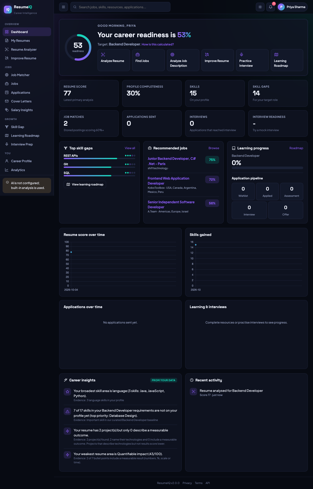
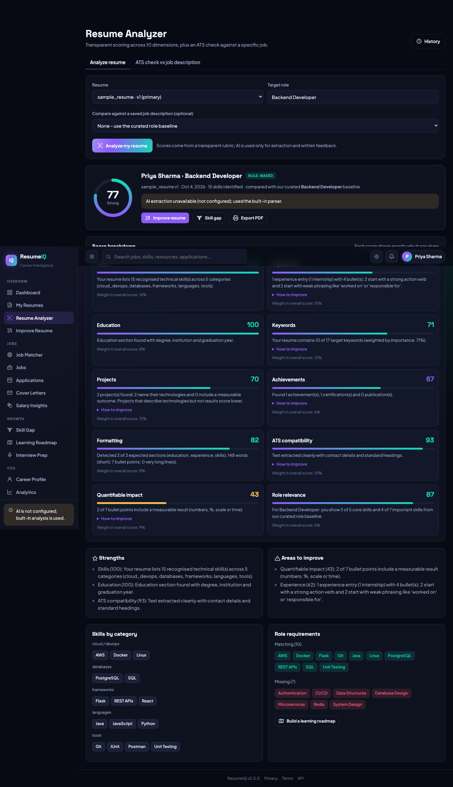
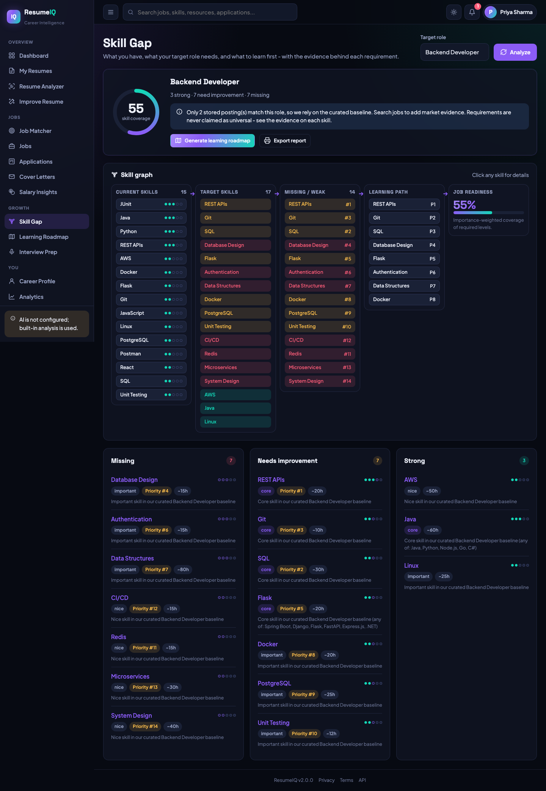
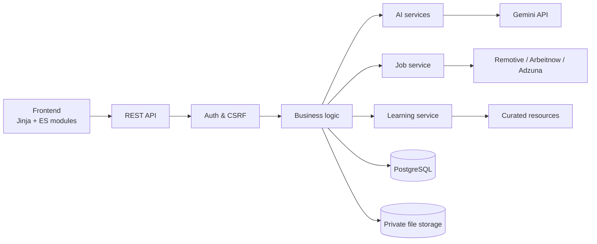

# ResumeIQ: AI Career Intelligence Platform

> *Given my resume, skills, experience and target career: what jobs fit me, what am I missing, how do I
> improve my resume, how do I prepare for interviews, and what should I learn next?*

ResumeIQ is a full-stack career platform built with Flask and PostgreSQL. It combines a **deterministic,
explainable analysis engine** with **schema-validated LLM features** (Google Gemini) and **real job data**
from public job APIs. Every score shows the reason behind it, and the AI never invents numbers,
experience, job listings or URLs.



## Features

| | |
|---|---|
| **Accounts** | Register / sign-in / remember-me / forgot & reset password · bcrypt · JWT in HTTP-only cookies with CSRF, refresh rotation, revocation, lockout and rate limits |
| **Resume management** | Multiple resumes (PDF/DOCX/TXT, 16 MB) · versions · rename / primary / download / delete · version comparison (skills, bullets, metrics, sections, score change) |
| **Resume analysis** | Structured extraction (AI, grounded against the text, with a heuristic fallback) · **10-part transparent score** (skills, experience, education, keywords, projects, achievements, formatting, ATS, quantifiable impact, role relevance), each with *why* and *how to improve* |
| **Resume improvement** | Current → improved rewrites for the whole resume, sections or a single bullet. Invented numbers are stripped automatically and "[add measurable result]" placeholders are used instead |
| **ATS analyzer & JD analyzer** | Required vs preferred skills, responsibilities, experience, education, certifications, salary. Resume comparison as **MATCHED / PARTIAL / MISSING / NOT RELEVANT** |
| **Job search & matching** | Live postings (Remotive, Arbeitnow, Adzuna), cached to respect provider terms. Filters for title, location, remote/hybrid/on-site, salary, level, company, skills, date. Explained match % (skills, experience, title, education, preferences) |
| **Skill gap & skill graph** | Curated role baselines + real job-posting frequency + your analysed JDs, with evidence on each skill · priority by importance, frequency, current level, difficulty and prerequisites · clickable 5-stage graph |
| **Learning roadmap & tracker** | Prerequisite-ordered phases with what to learn, why, resources (link-checked catalog), projects and time estimates · resource and phase status · hours, courses, projects, certifications |
| **Project recommendations** | Portfolio projects that target your gaps: difficulty, skills, features, duration, resume value |
| **Interview prep & mock interview** | Resume/JD-grounded questions in 6 categories (why it's asked, strong-answer points, common mistakes) · chat-style mock interview with follow-ups and a final report. Text-only indicators, never personality judgments |
| **Cover letters** | 4 tones, built only from resume facts · copy / edit / regenerate / save |
| **Applications** | Kanban (Wishlist → Applied → OA → Interview → Offer / Rejected), drag-and-drop plus an accessible stage menu, stage history |
| **Analytics & insights** | Response, interview and offer rates with small-sample warnings · charts · data-backed career insights with evidence |
| **Salary insights** | Data from real postings (quartiles by level, sample size, source, date range) shown **separately** from an optional AI interpretation |
| **Platform** | Notifications and reminders with preferences · global search (⌘K) · dark/light/system themes · print-to-PDF reports · admin panel (aggregates only) · data export and full account deletion |

<p>


</p>

## Architecture



**Deterministic core, AI at the edges.** Scoring, matching, gap prioritisation and roadmap ordering are
deterministic. The LLM handles extraction (validated and grounded) and prose, and has a rule-based fallback
for each. Details in [docs/ARCHITECTURE.md](docs/ARCHITECTURE.md).

```
resumeiq/
  __init__.py          app factory: extensions, security headers, JWT callbacks, CLI
  config.py            env-driven config (dev / testing / production)
  models/              SQLAlchemy models (36 tables)
  api/                 REST blueprints + Pydantic request schemas
  services/            business logic
    ai/                Gemini client (validation, retry, quotas, usage) + response schemas
    resume_parser.py   heuristic parser + AI-merge with grounding
    scoring.py         transparent 10-component rubric
    skill_extraction.py taxonomy matching, JD requirement classification, role resolution
    ats.py  jd_service.py  improvement.py  skill_gap.py  job_sources.py  job_matching.py
    roadmap.py  interview.py  cover_letter.py  salary.py  analytics.py  notifications.py  tasks.py
  data/                skill taxonomy + role profiles, curated resources, project templates
  web/routes.py        page shells + print reports
  templates/  static/css/  static/js/{core,pages}/
migrations/  tests/  docs/  deploy/
```

## Tech stack

Python 3.12 · Flask 3 · SQLAlchemy 2 · Alembic · PostgreSQL 16 · Pydantic 2 · Flask-JWT-Extended ·
Flask-Limiter · bcrypt · pdfplumber · python-docx · Google Gemini (REST) · Gunicorn · Docker · Caddy (HTTPS) ·
vanilla ES modules + Chart.js · pytest.

## Getting started

```bash
python3.12 -m venv .venv && source .venv/bin/activate
pip install -r requirements-dev.txt
createdb resumeiq
cp .env.example .env            # set SECRET_KEY, JWT_SECRET, DATABASE_URL (GEMINI_API_KEY optional)
export FLASK_APP=wsgi.py
flask db upgrade                # create the schema
flask seed                      # skill taxonomy + learning resources
flask create-admin              # optional: admin account
flask run                       # http://localhost:5000
```

Without `GEMINI_API_KEY`, everything still works using the built-in parser, rule-based feedback and the
curated question bank. The UI labels which method was used.

### Environment variables

| Variable | Purpose |
|---|---|
| `SECRET_KEY`, `JWT_SECRET` | Required in production (32+ chars; the app refuses to start otherwise) |
| `DATABASE_URL` | PostgreSQL URL (`postgres://` is normalised) |
| `GEMINI_API_KEY`, `GEMINI_MODEL` | AI features (server-side only, sent via header) |
| `AI_DAILY_REQUEST_LIMIT`, `AI_DAILY_TOKEN_LIMIT`, `AI_TIMEOUT_SECONDS`, `AI_MAX_RETRIES` | Cost control |
| `ADZUNA_APP_ID`, `ADZUNA_APP_KEY`, `ADZUNA_COUNTRY` | Optional: more listings + salary histogram |
| `JOB_PROVIDERS`, `JOB_CACHE_HOURS` | Providers and cache window |
| `COOKIE_SECURE`, `TRUST_PROXY`, `CORS_ORIGINS`, `RATELIMIT_STORAGE_URI` | Deployment and security |
| `STORAGE_DIR` | Upload directory (outside any served path) |
| `SMTP_*`, `APP_BASE_URL` | Password-reset email |

See [.env.example](.env.example) for the full list.

### Useful commands

| Command | |
|---|---|
| `flask seed` | Load the taxonomy and resources (idempotent) |
| `flask create-admin` | Create or promote an admin |
| `flask fetch-jobs "backend developer"` | Warm the job cache |
| `flask send-reminders` | Interview, follow-up and saved-job reminders (schedule with cron) |
| `flask cleanup` | Remove orphaned files, expired tokens and stale jobs |

## Testing

```bash
pytest                                   # SQLite in-memory
TEST_DATABASE_URL=postgresql://localhost/resumeiq_test pytest   # real PostgreSQL
pytest --cov=resumeiq
```

132 tests (87% coverage) cover authentication and sessions, password hashing, CSRF, file validation
(spoofed types, macros, size, traversal), text extraction, parsing and skill extraction, scoring, the
fabrication guard, AI validation/retry/quota/grounding, the guarantee that the AI can't change scores, job
ingestion, caching, outages and matching, skill gaps and roadmaps, interviews, applications, notifications,
authorization between users, admin isolation, account deletion, and rendering of every page. CI runs the
suite on SQLite and PostgreSQL ([.github/workflows/ci.yml](.github/workflows/ci.yml)).

## Deployment

```bash
cp .env.example .env    # fill in secrets
docker compose up --build                               # app + PostgreSQL on :8000
DOMAIN=resumeiq.example.com docker compose --profile https up --build   # + Caddy with automatic HTTPS
```

### Render (one click)

[](https://render.com/deploy?repo=https://github.com/Srujanreddy1234/RESUMEIQ)

[render.yaml](render.yaml) creates the Docker web service and a PostgreSQL database, generates `SECRET_KEY`/`JWT_SECRET`,
and prompts for the optional `GEMINI_API_KEY` and Adzuna keys. On the free plan the instance sleeps when idle and
uploaded files don't survive a redeploy (switch to `starter` and enable the disk in `render.yaml` to keep them).

### Notes

The container runs as a non-root user, applies migrations and seeds on start
([deploy/entrypoint.sh](deploy/entrypoint.sh)), serves with Gunicorn (gthread), stores uploads on a volume,
and has a Docker `HEALTHCHECK` against `GET /health`. For PaaS (Railway, Render, Fly), use the Dockerfile,
attach PostgreSQL, set the env vars, and set `TRUST_PROXY=true`. With several instances, set
`RATELIMIT_STORAGE_URI=redis://...`.

## Documentation

- [Architecture & security](docs/ARCHITECTURE.md)
- [Database schema (ER diagram)](docs/DATABASE.md)
- [REST API](docs/API.md) · live route index at `GET /api/docs`

## Future improvements

- Move background tasks to RQ/Celery with Redis for multi-host scaling and scheduled reminders.
- Email verification and optional OAuth sign-in.
- Embedding-based semantic matching alongside taxonomy matching.
- OCR for scanned PDFs.
- Server-side PDF generation for reports (currently print-to-PDF).
- OpenAPI spec generated from the Pydantic schemas.
