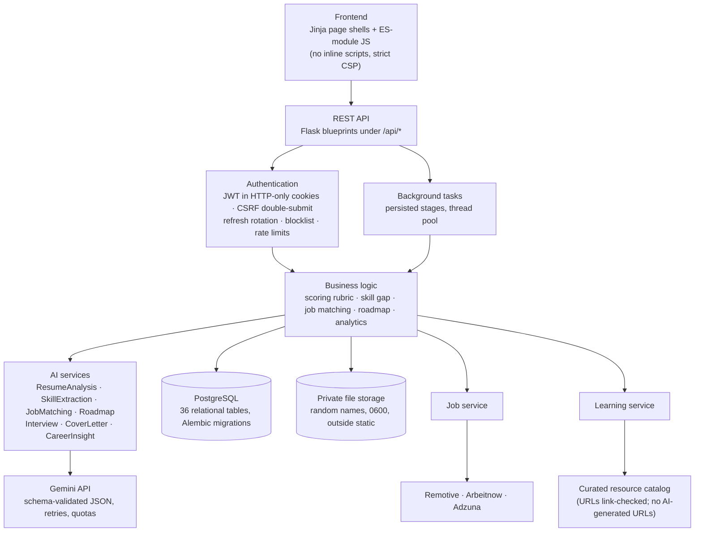

# Architecture

## System overview

## Design principles

1. **Deterministic core, AI at the edges.** Skill extraction, scoring, ATS comparison, job matching, gap
   prioritisation and roadmap ordering are deterministic and explainable. The LLM is used only for
   structured extraction (cross-checked against the text) and for written feedback. It can never change a
   number. `tests/test_ai.py::test_llm_cannot_change_rubric_score` enforces this.
2. **Graceful degradation.** Every AI feature has a rule-based fallback, and the UI labels the method used
   ("AI-assisted" or "Rule-based"). Job APIs failing returns stored results plus a status message.
3. **No fabrication.** AI output is grounded: a skill, employer or certification that doesn't appear in the
   source text is dropped. Improved bullets may not introduce new numbers (`guard_fabrication`). Job
   listings come only from real APIs, and learning URLs only from a reviewed catalog.
4. **Evidence everywhere.** Each score component, skill gap, match and insight carries the reason and data
   behind it. Small samples are flagged rather than presented as conclusions.

## Request lifecycle

1. `init_request_tracing` assigns a request ID, and later logs method, path, status, latency and user ID as
   structured JSON. Bodies are never logged.
2. Flask-Limiter applies global and per-endpoint limits. AI endpoints are keyed per user.
3. `login_required` verifies the JWT cookie (with CSRF on state-changing methods), the blocklist, the
   `token_version` claim (bumped on password change or reset) and that the account is active.
4. Pydantic schemas validate request bodies (422 with per-field details).
5. Services do the work. Ownership is checked with `get_owned()`, which returns 404 rather than 403 so the
   existence of other users' data isn't revealed.
6. Errors map to a uniform `{"error": {code, message, details, request_id}}` shape. Unexpected exceptions
   are logged (secrets scrubbed), recorded as a `system_event`, and returned as a generic 500.

## Long-running AI work

`POST /api/analysis` creates a `background_tasks` row with named stages and returns `202`. A worker thread
marks each stage `running`, `done` or `skipped` **only when that work actually happens**, and the UI polls
`GET /api/tasks/<id>` to show real processing stages, never a fake percentage. Because tasks are stored in the
database, any web worker can answer a poll. The `submit()`/`TaskContext` interface is small enough to swap
the thread pool for RQ or Celery without changing services.

## AI client (`services/ai/client.py`)

- Key from `GEMINI_API_KEY` only, sent in the `x-goog-api-key` header (never in the URL or to the browser).
- The Pydantic model is converted to Gemini's `responseSchema`, and every response is validated against it.
  Invalid output is retried with the validation errors fed back, up to `AI_MAX_RETRIES`.
- Timeout, exponential backoff on 429/5xx/network errors, and fallback to prompt-only JSON if the schema is
  rejected.
- Each call is logged to `ai_usage_logs` (service, tokens, latency, attempts, success, error type).
- Per-user daily request and token quotas. Admins see usage and failures by service.
- A shared system prompt marks resume and JD text as untrusted data (prompt-injection guard) and forbids
  inventing facts or judging personality.

## Security controls (summary)

| Area | Control |
|---|---|
| Passwords | bcrypt (12 rounds), strength rules, common-password list, timing-equalised login |
| Sessions | 15-min access JWT + rotating refresh JWT, HTTP-only `Secure` `SameSite=Lax` cookies, CSRF header, blocklist, lockout after 5 failures |
| Input | Pydantic validation, http(s)-only URLs, length limits, parameterised SQL via SQLAlchemy |
| Output | Jinja autoescaping, `esc()` for every dynamic value in JS, CSP `script-src 'self'` |
| Files | Extension **and** signature check, macro/zip-bomb DOCX rejection, 16 MB limit, random names, 0600 perms, stored outside static, authorised download only |
| Headers | CSP, HSTS (when secure), X-Frame-Options DENY, nosniff, Referrer-Policy, Permissions-Policy |
| Secrets | Environment only. Production refuses to boot without strong `SECRET_KEY`/`JWT_SECRET`. Log scrubber redacts keys, JWTs and passwords |
| Privacy | Data export, delete resume, delete history, delete account (files included). Admin APIs expose aggregates only |
