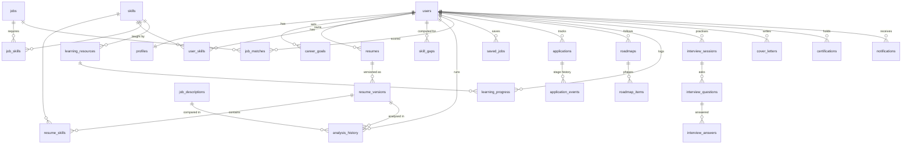

# Database schema

PostgreSQL 16 with schema changes managed by Alembic (`migrations/`). Every table has a primary key; foreign
keys use `ON DELETE CASCADE` (user-owned data) or `SET NULL` (history that should outlive a deleted file).
Constraint names are deterministic (see `extensions.naming_convention`).

## Tables

| Group | Tables |
|---|---|
| Identity | `users`, `profiles`, `password_reset_tokens` (SHA-256 hash only), `token_blocklist` |
| Career profile | `career_goals`, `education`, `experiences`, `user_projects`, `certifications`, `user_skills` |
| Resumes | `resumes`, `resume_versions` (file metadata, extracted text, structured parse snapshot, latest score), `resume_skills` |
| Analysis | `analysis_history` (overall score column + per-component breakdown), `job_descriptions` |
| Skills | `skills` (taxonomy), `skill_gaps` (status, levels, priority, evidence) |
| Jobs | `jobs` (unique `source`+`external_id`), `job_skills`, `job_matches` (score + component columns), `saved_jobs`, `job_source_fetches` (provider cache) |
| Learning | `learning_resources`, `roadmaps`, `roadmap_items`, `learning_progress` |
| Interview | `interview_sessions`, `interview_questions`, `interview_answers` |
| Applications | `applications`, `application_events`, `cover_letters` |
| Platform | `notifications` (unique `user_id`+`dedupe_key`), `ai_usage_logs`, `background_tasks`, `system_events` |

## Notable indexes and constraints

- Unique: `users.email`, `skills.name/slug`, `(resume_id, version_number)`, `(resume_version_id, skill_id)`,
  `(user_id, skill_id)` on `user_skills`, `(user_id, target_role, skill_id)` on `skill_gaps`, `(source, external_id)`
  on `jobs`, `(user_id, job_id)` on `job_matches`/`saved_jobs`, `(user_id, resource_id)` on `learning_progress`.
- Composite: `applications(user_id, stage)`, `job_matches(user_id, score)`, `notifications(user_id, is_read)`,
  `ai_usage_logs(user_id, created_at)`, `system_events(category, created_at)`, `job_source_fetches(source, query_key, fetched_at)`.
- Every `user_id` and `created_at` column is indexed. Lists are paginated server-side.

## Where JSON is used, and why

JSON columns hold **snapshots and small lists**, not core relational data: a resume's structured parse
(the normalised rows live in `resume_skills`, `education`, `experiences`, ...), an analysis report's
per-component explanations, evidence strings, and stage lists for background tasks. Anything that is queried,
joined or aggregated (skills, scores, stages, matches, progress) has real columns and tables.
